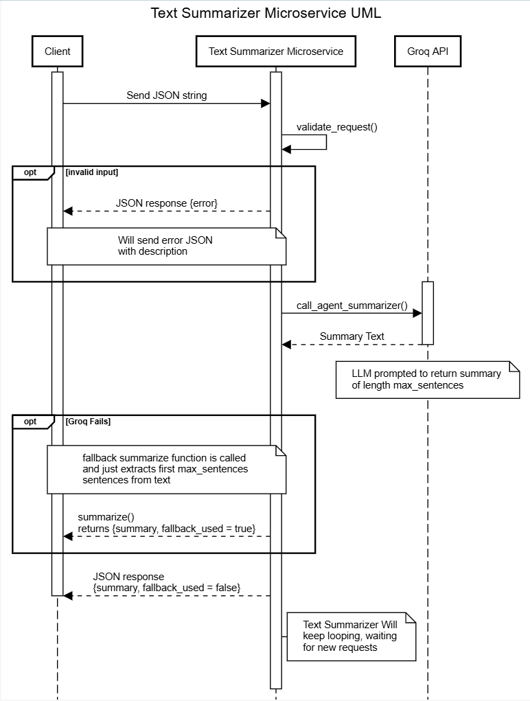

# Text Summarizer Microservice

A ZMQ-based microservice that summarizes text using an LLM (Groq) with a simple sentence-extraction fallback. Given a block of text, it returns a condensed version in a configurable number of sentences, making it easy to integrate text summarization into any application without managing LLM calls directly.

## Prerequisites

- Python 3.10+
- A [Groq](https://console.groq.com) API key (for LLM summarization)

## Setup

### 1. Create a virtual environment

```bash
python3 -m venv venv
```

### 2. Activate the virtual environment

**macOS / Linux:**

```bash
source venv/bin/activate
```

**Windows (Command Prompt):**

```cmd
venv\Scripts\activate.bat
```

**Windows (PowerShell):**

```powershell
venv\Scripts\Activate.ps1
```

### 3. Install dependencies

```bash
pip install -r requirements.txt
```

### 4. Configure environment

Create a `.env` file in the project root with your Groq API key:

```
GROQ_API_KEY=your_api_key_here
```

Get an API key at [Groq Console](https://console.groq.com).

## Running the service

With the virtual environment activated:

```bash
python main.py
```

You should see:

```
Text Summarizer Microservice running on: Port 5555
```

The service listens on **TCP port 5555**. Send JSON requests with `text` and optional `max_sentences`; it responds with `summary` (and `fallback_used` when the basic summarizer was used instead of the LLM).


### Communication Contract

**Overview:**
This microservice communicates over ZeroMQ (ZMQ) using the REQ/REP (request/reply) pattern over TCP. The client sends a JSON string, waits for a response, and receives a JSON string back.
- Protocol: TCP
- Port: 5555
- Pattern: ZMQ REQ/REP
- Format: JSON

**Requesting Data:**
To call the microservice, connect a client to port 5555. Then, clients send a JSON string containing the text to summarize and an optional parameter for the maximum number of sentences in the summary.

Example request:

```python
context = zmq.Context()
socket = context.socket(zmq.REQ)
socket.connect("tcp://localhost:5555")

request = {
    "text": "Your long text goes here...",
    "max_sentences": 2  # Optional, defaults to 3 if not provided
}

socket.send_string(json.dumps(request))
```

**Receiving Data:**
The microservice processes the request and either returns a JSON string containing a successful summary or an error message. If successful, it returns a JSON string containing the summary of the text and a boolean flag `fallback_used` indicating whether the basic sentence-extraction method was used instead of the LLM. If there was an error (e.g., invalid input, LLM failure), it returns a JSON string containing an `error` field with a descriptive message.

Example response:

```python

response_str = socket.recv_string()
response = json.loads(response_str)

if "error" in response:
    print("Error:", response["error"])
else:
    print("Summary:", response["summary"])
    print("Fallback Used:", response["fallback_used"])
```

Example Success Response:
```json
{
    "summary": "This is a condensed version of the original text.",
    "fallback_used": false
}
```
Example Error Response:
```json
{
    "error": "Field 'text' is required and cannot be empty or whitespace."
}
```

## Input Validation Rules
The microservice will return an error response instead of a summary if:
- The request is not valid JSON.
- The request is not a JSON object (e.g., it's an array or a primitive value).
- The `text` field is missing, empty, contains only whitespace, or is fewer than 10 characters long.
- The `max_sentences` field is provided but is not a positive integer in the range of 1 to 10.

## UML Sequence Diagram

